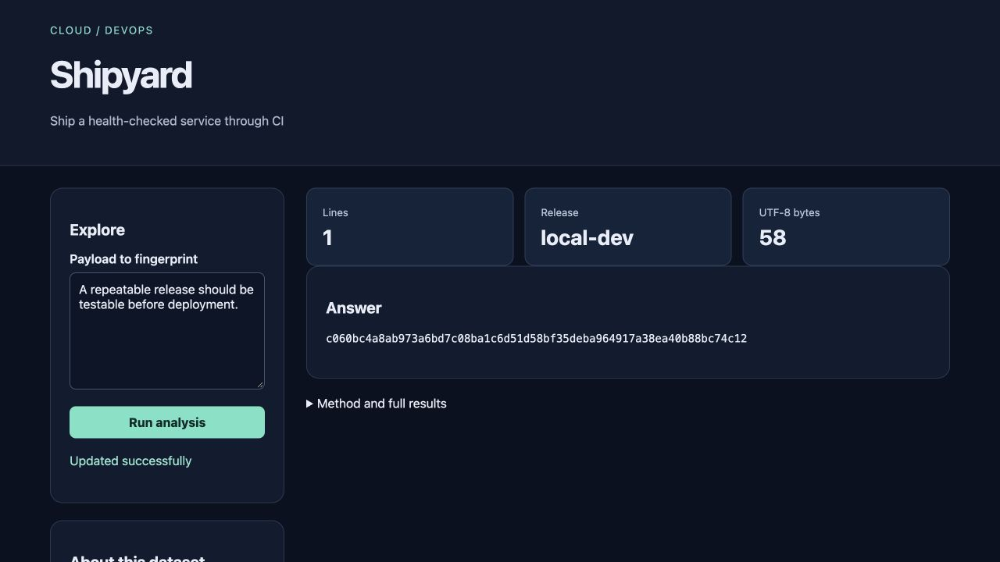

# Shipyard

Ship a health-checked service through CI for **junior platform engineers**.

Cloud/DevOps topic selected with explicit user authorization after source verification; it is not attributed to an unseen Instagram slide.

> Local portfolio implementation developed with Codex assistance. Measured results and limitations are documented; no production adoption, revenue or hiring outcome is claimed.



## What works

- Container build
- non-root app
- CI tests
- smoke deployment
- rollback notes

[Example output](reports/example-output.json) · [Recorded checks](reports/test-results.txt) · [Learning and interview guide](LEARNING_GUIDE.md)

## Start

Python 3.12 is the validated Python runtime. Run commands from this repository directory. Windows users activate `.venv\Scripts\activate` instead of `source`.

```sh
python3.12 -m venv .venv
source .venv/bin/activate
python -m pip install -r requirements.txt
python app.py
```

Open **http://127.0.0.1:8080**. Keep the process running. Set `PORT` to use another port. The Python development servers are intended for local demonstrations.

Container workflow: `docker compose up --build`, then `python smoke.py`. CI deploys only a temporary test container. See [rollback notes](ROLLBACK.md).

## Demonstration

Run docker compose up --build, open the app, fingerprint a payload and run python smoke.py. Inspect the verified GitHub Actions run for build, non-root and smoke evidence.

## Architecture and decisions

Browser controls → validated Flask API → project analysis/workflow → results and export.

Stack: Docker · GitHub Actions · Flask.

1. Package a deterministic API with a non-root runtime and read-only container filesystem.
2. CI runs unit tests before building, then starts a real temporary container and checks readiness plus a known digest.
3. Keep rollback instructions explicit and retain prior image tags rather than assuming deployment success.

## Verification

```sh
python -m pytest -q
```

See [VERIFICATION.md](VERIFICATION.md) for actual executed checks, setup verification, model/data results and any outstanding environment limitations. The [recorded CI runs](reports/ci-verification.json) passed for the linked source revision.

## Data and attribution

Local service; temporary CI containers. See [DATA_AND_SOURCES.md](DATA_AND_SOURCES.md) for provenance and usage notes. Original project code is MIT unless a preserved source file or dependency states otherwise. Model and third-party data licenses remain separate.

## Limitations and next improvement

The delivery target is an ephemeral CI container or local Docker Compose. No public service, registry publishing, TLS, zero-downtime rollout or production traffic is configured. Docker image base tags are versioned but not digest-pinned.

Suggested extension: Add a readiness dependency that can intentionally fail, and prove the pipeline blocks promotion.

## Honest portfolio use

This implementation and documentation were developed with substantial Codex assistance. Before presenting it, run the demonstration, explain the design choices, and complete the suggested independent modification. Do not describe generated code as work experience, an accepted upstream contribution, or a deployed production service.
